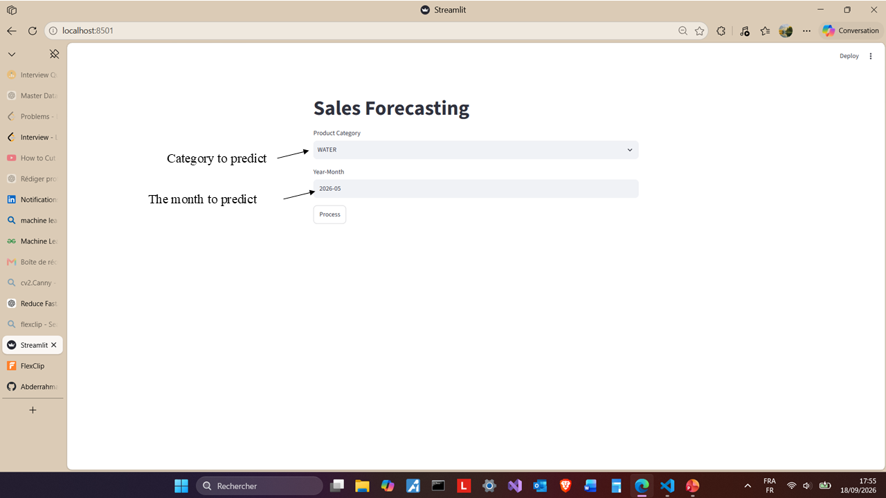
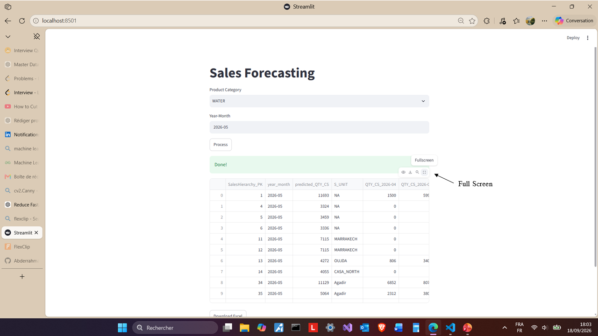
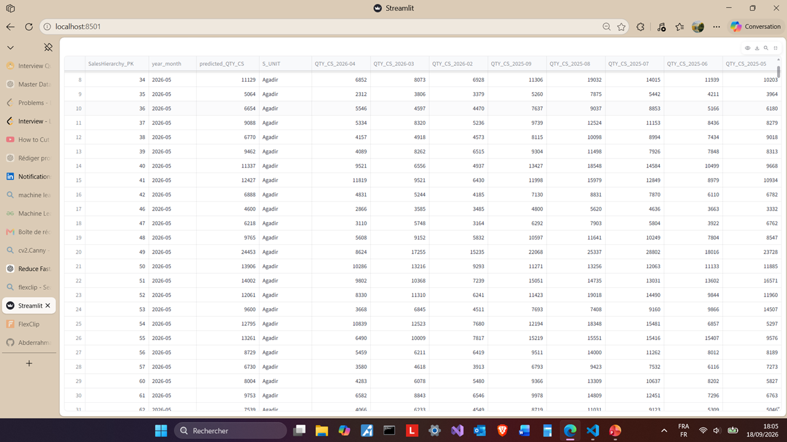
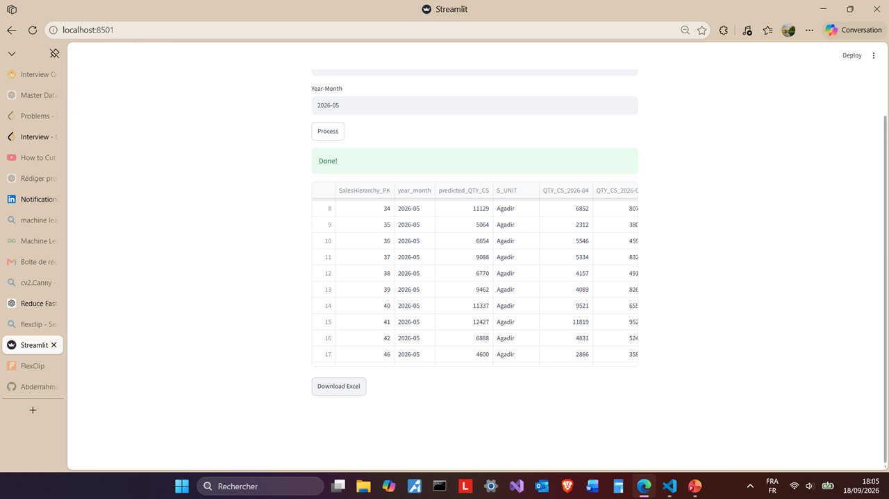
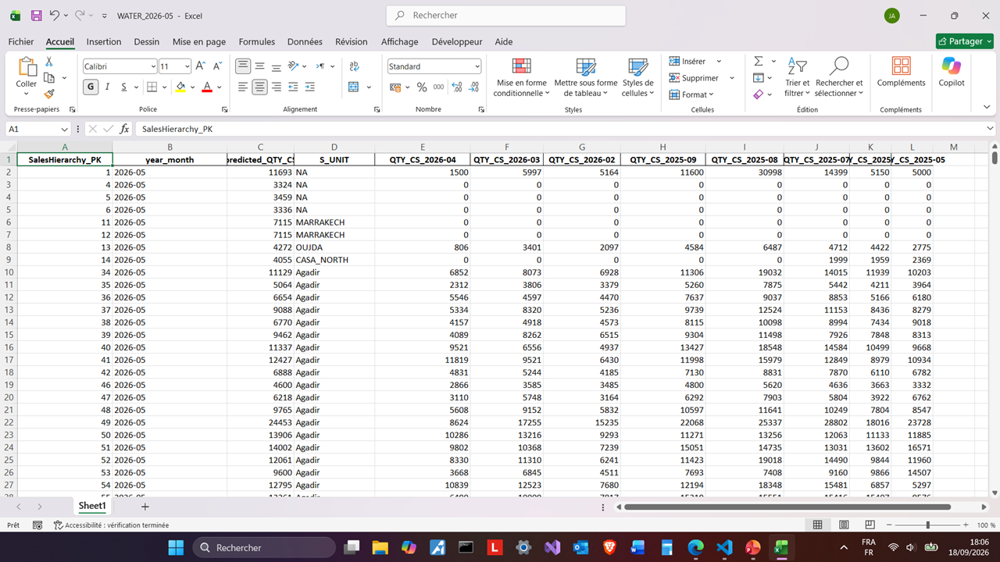

# 📈 Sales Forecasting Project

<div align="center">


</div>

---

##  Overview

This project is a **monthly sales forecasting application** designed to forecast sales quantities for different product categories.

The application builds features from historical sales data, trains an **XGBoost regression model**, and generates a sales forecast for a selected product category and year-month.

The application is built with **Streamlit** and uses **SQL Server** as the source of historical sales data.

The forecasting pipeline works in two main stages:

1. Load historical sales data for the selected product category.
2. Prepare monthly features, train the forecasting model, and generate a prediction for the requested month.

---

## 🖼️ Application Screenshots

<p align="center">
  
</p>

<p align="center">
  
  
</p>

<p align="center">
  
  
</p>

---

## 🛍️ Supported Product Categories

The application supports the following product categories:

- CSD
- WATER
- ENERGY
- LIPTON
- SNACKS


## 🧩 Project Structure

```text
Sales-Forecasting-System-VBM/
│
├── app.py
├── trainer.py
├── inference.py
├── models/
│   ├── xgb_best_params.json
│   ├── xgb_model_CSD.json
│   ├── xgb_model_WATER.json
│   ├── xgb_model_ENERGY.json
│   ├── xgb_model_LIPTON.json
│   └── xgb_model_SNACKS.json
│
├── images/
│   ├── Diapositive1_first_interface.PNG
│   ├── Diapositive2_Full_screen_button.PNG
│   ├── Diapositive3_full_screen_results.PNG
│   ├── Diapositive4_download_xlsx_format.PNG
│   └── Diapositive5_results_xlsx.PNG
│
├── video_demo.webm
├── how_to_run.txt
├── requirements.txt
└── README.md
